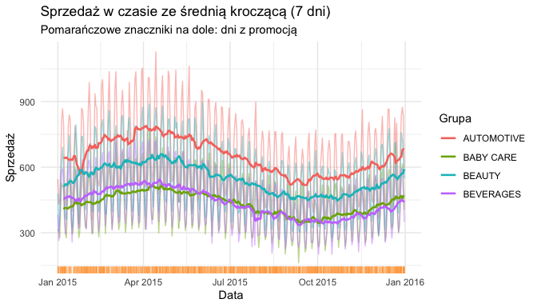
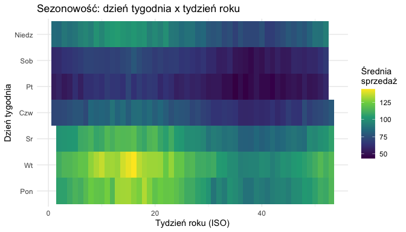
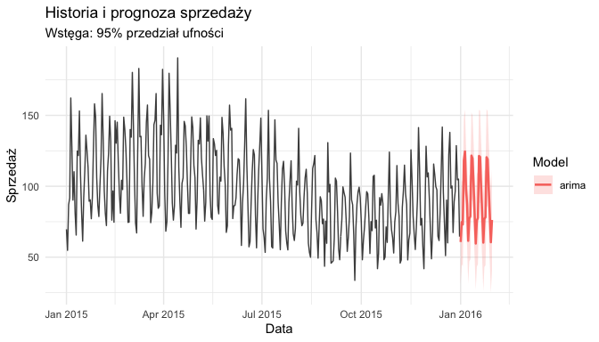

<!-- README.md is generated from README.Rmd. Please edit that file -->

# salesTS

`salesTS` to pakiet R do analizy detalicznych szeregów czasowych
sprzedaży. Dostarcza spójny pipeline: od wczytania surowych plików CSV,
przez kontrolę jakości danych, czyszczenie i inżynierię metryk, aż po
wizualizacje, podsumowania menedżerskie i prognozy ARIMA oraz Prophet.

> Konwencja: nazwy funkcji i dokumentacja są po angielsku, natomiast
> komunikaty dla użytkownika oraz raporty biznesowe są po polsku.

## Instalacja

``` r
# install.packages("devtools")
devtools::install_github("FRatnayake/projekt_szeregi_czasowe")
```

## Przykład end-to-end (na danych wbudowanych)

``` r
library(salesTS)
suppressPackageStartupMessages(library(dplyr))

# Łączymy sprzedaż z metadanymi sklepów.
data <- sample_sales |>
  left_join(sample_stores, by = "store_nbr")
```

### 1. Walidacja jakości danych

``` r
walidacja <- validate_sales_ts(data)
summary(walidacja)
#> # A tibble: 8 × 2
#>   sprawdzenie          liczba
#>   <chr>                 <dbl>
#> 1 Braki NA (suma)          18
#> 2 Duplikaty klucza          3
#> 3 Poza zakresem             4
#> 4 Wartości ujemne           4
#> 5 Serie z lukami            1
#> 6 Brakujące dni (luki)      5
#> 7 Daty z przyszłości        0
#> 8 Błędne onpromotion        0
```

### 2. Czyszczenie

``` r
dane_czyste <- clean_sales_ts(data, missing = "interpolate", dedupe = "sum")
attr(dane_czyste, "cleaning_log")
#> # A tibble: 3 × 2
#>   krok                    liczba
#>   <chr>                    <int>
#> 1 duplikaty_usuniete           3
#> 2 wiersze_usuniete_NA          0
#> 3 wartosci_NA_uzupelnione     18
```

### 3. Metryki sprzedaży

``` r
metryki <- compute_sales_metrics(dane_czyste, group_by = c("store_nbr", "family"))
head(metryki)
#> # A tibble: 6 × 15
#>   store_nbr family     total_sales mean_sales moving_avg_last volatility_sd
#>       <int> <chr>            <dbl>      <dbl>           <dbl>         <dbl>
#> 1         1 AUTOMOTIVE      42856.      119.            127.           37.9
#> 2         1 BABY CARE       25020.       68.5            76.6          21.2
#> 3         1 BEAUTY          43209.      118.            135.           34.5
#> 4         1 BEVERAGES       35598.       97.5            93.7          30.6
#> 5         2 AUTOMOTIVE      40858.      112.            117.           31.5
#> 6         2 BABY CARE       25466.       69.8            80.6          21.2
#> # ℹ 9 more variables: volatility_cv <dbl>, promo_share <dbl>,
#> #   peak_distance_days <dbl>, promo_uplift_pct <dbl>, growth_pop <dbl>,
#> #   cagr <dbl>, trend_slope <dbl>, zero_sales_rate <dbl>,
#> #   holiday_uplift_pct <dbl>
```

### 4. Wizualizacje

``` r
plot_sales_trends(dane_czyste, type = "line", group_by = "family")
```



``` r
plot_sales_trends(dane_czyste, type = "heatmap")
```



### 5. Podsumowanie menedżerskie

``` r
podsumowanie <- create_management_summary(dane_czyste, period_days = 30)
podsumowanie
#> # A tibble: 2 × 3
#>   okres           suma srednia
#>   <chr>          <dbl>   <dbl>
#> 1 Bieżący       62092.    86.2
#> 2 Rok wcześniej     0    NaN
#> # A tibble: 4 × 2
#>   family     promo_uplift_pct
#>   <chr>                 <dbl>
#> 1 BEAUTY                 30.7
#> 2 BEVERAGES              27.8
#> 3 AUTOMOTIVE             17.1
#> 4 BABY CARE              14.2
```

### 6. Programowanie funkcyjne (wiele analiz naraz)

``` r
wyniki <- sales_ts_logic(
  dane_czyste,
  .funs = list(metryki = function(d) compute_sales_metrics(d, group_by = "family")),
  filters = list(type = sort(unique(dane_czyste$type))[1]),
  group_by = "store_nbr"
)
names(wyniki)
#> [1] "3" "5"
```

### 7. Prognoza (ARIMA vs Prophet)

``` r
prognoza <- create_prognosis(
  dane_czyste,
  series = list(store_nbr = 1, family = "BEVERAGES"),
  models = "arima",
  horizon = 30,
  backtest = TRUE
)
prognoza$backtest
#> # A tibble: 1 × 4
#>   model  RMSE   MAE  MAPE
#>   <chr> <dbl> <dbl> <dbl>
#> 1 arima  20.6  16.5  18.6
plot(prognoza)
```



## Funkcje

Funkcja \| Opis \|  
`load_sales_data()` \| Wczytanie i wzbogacenie danych (metadane, święta)
\|  
`load_holiday_data()` \| Wczytanie i parsowanie kalendarza świąt \|  
`validate_sales_ts()` \| Kontrola jakości danych (bez modyfikacji) \|  
`clean_sales_ts()` \| Czyszczenie: braki, duplikaty, agregacja \|  
`compute_sales_metrics()` \| Metryki sprzedaży per grupa \|  
`plot_sales_trends()` \| Wizualizacje
(line/decomposition/heatmap/promo/holiday) \|  
`create_management_summary()` \| Narracyjne podsumowanie menedżerskie
\|  
`sales_ts_logic()` \| Funkcja wyższego rzędu: filtry + zestaw analiz
\|  
`create_prognosis()` \| Prognozy ARIMA i Prophet z backtestingiem \|  
`make_sample_sales()` \| Generator syntetycznych danych \|
